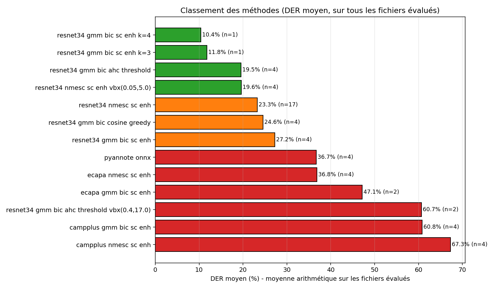
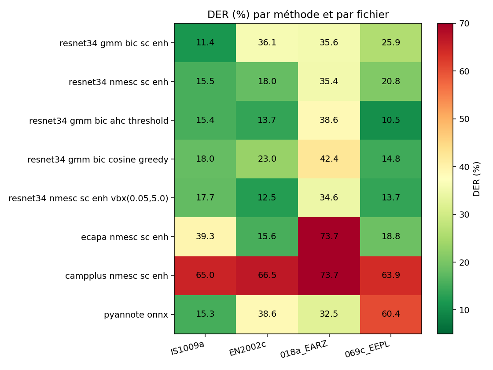
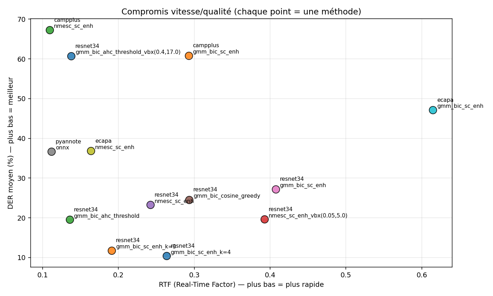
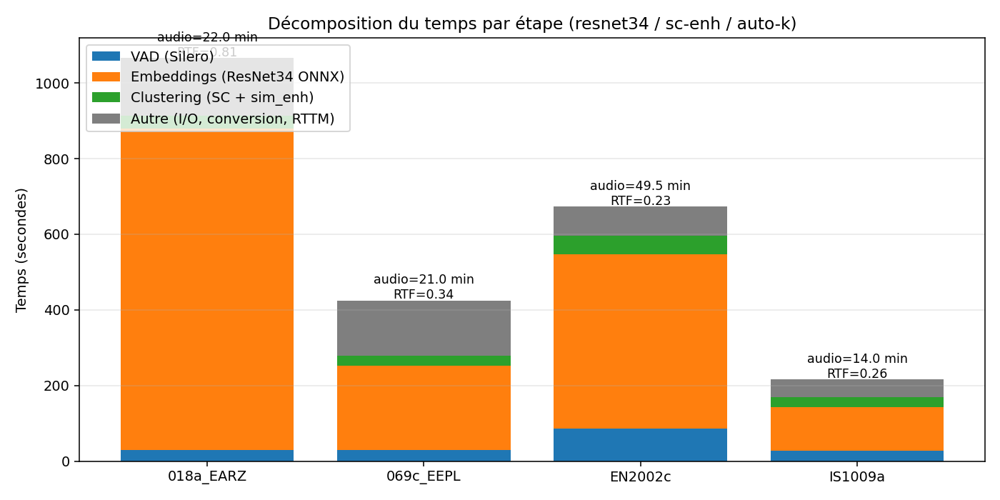
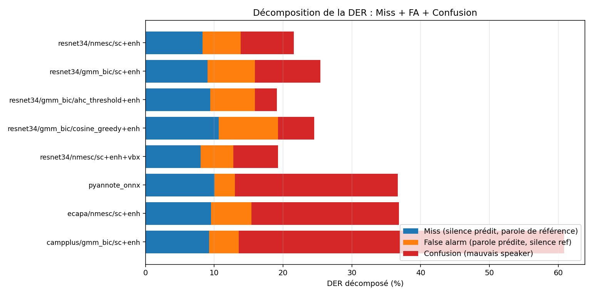
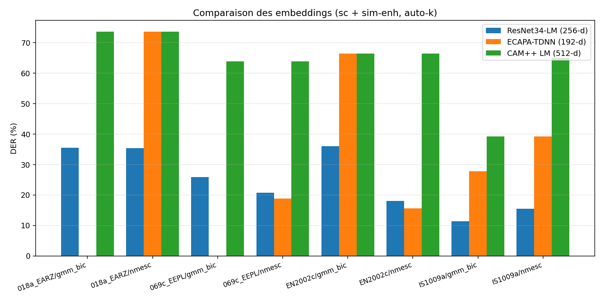
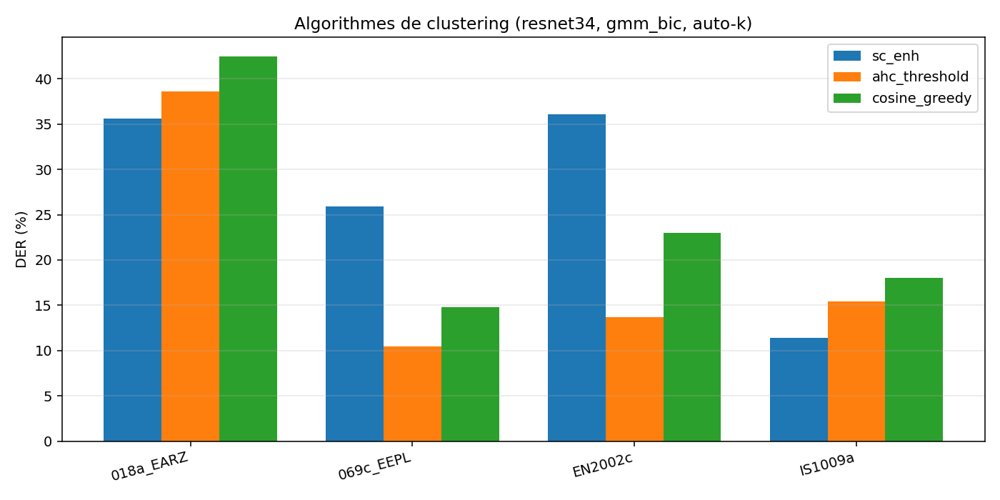
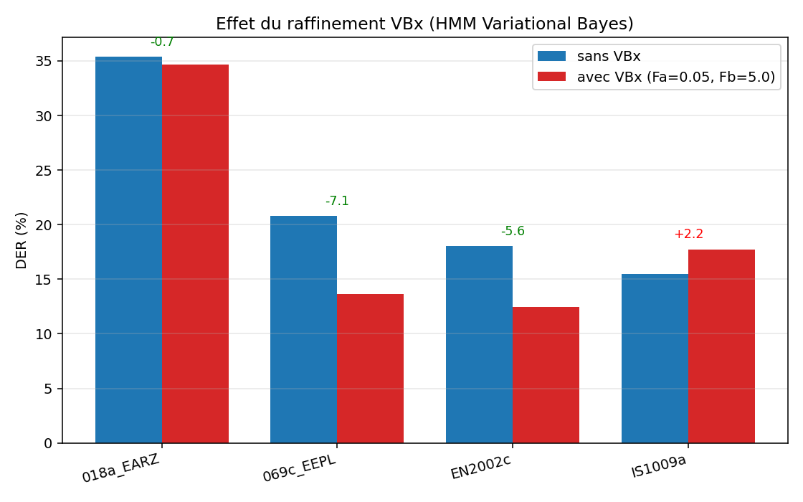
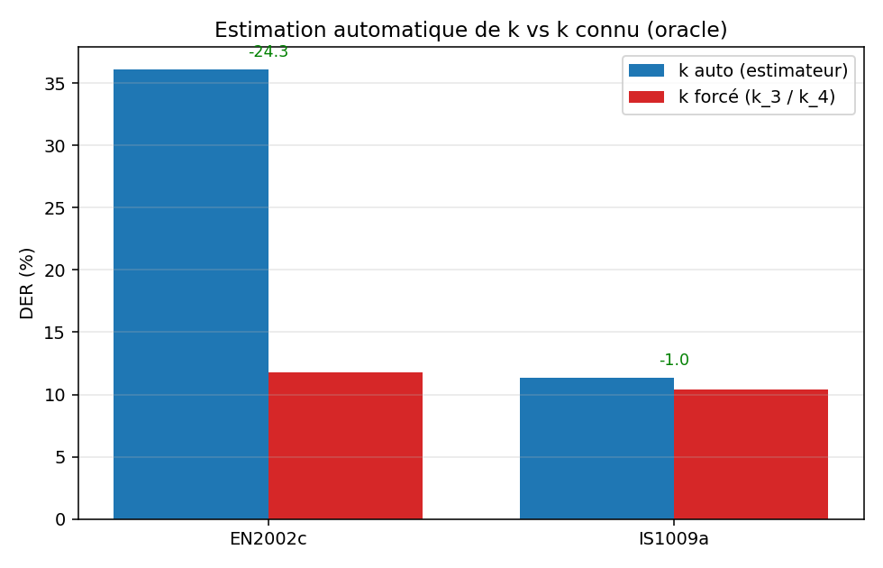
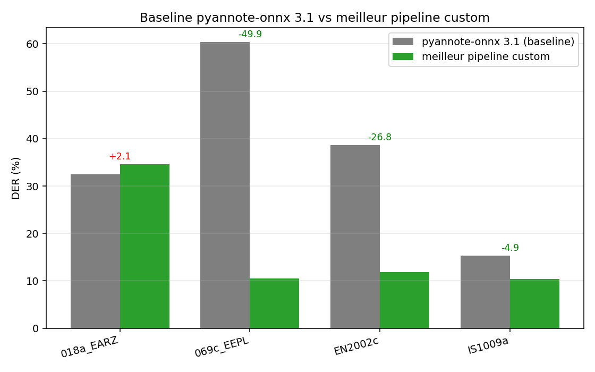

# Compte-rendu de benchmark — Pipeline de diarisation modulaire

**Projet :** `diarisation+transcription`  
**Tracker :** MLflow (`mlruns/`, `mlflow.db`) — 126 runs, 18 fichiers audio, 62 configurations uniques (24 jeux de paramètres ré-exécutés, soit ~64 doublons d'exécution).  
**Date de compilation :** 2026-04-27.  
**Source des chiffres :** agrégation automatique de tous les `artifacts/config.json` et `artifacts/der.json` des runs MLflow.

---

## 1. Contexte et objectif

L'objectif du projet est de bâtir un pipeline de **diarisation locale** (qui parle quand) capable de tourner sans GPU, à partir de modèles ONNX, et d'égaler — voire battre — la baseline `pyannote-onnx 3.1` sur des réunions et des dictées en français/anglais.

Le pipeline est volontairement **modulaire** : chaque étape (VAD → embeddings → estimation de *k* → clustering → raffinement) peut être permutée indépendamment, ce qui rend possible une comparaison contrôlée des méthodes. Toutes les métriques, paramètres et artefacts sont loggés dans MLflow afin de garantir la reproductibilité et l'éligibilité au dédoublonnage.

---

## 2. Protocole expérimental

### 2.1 Corpus

| Fichier            | Type             | Durée (min) | # runs |
|--------------------|------------------|------------:|-------:|
| AMI / IS1009a      | meeting EN, IHM  | 13.98       | 34     |
| AMI / IS1009b      | meeting EN, IHM  | 34.21       | 2      |
| AMI / EN2002a      | meeting EN, IHM  | ~50         | 2      |
| AMI / EN2002c      | meeting EN, IHM  | 49.54       | 27     |
| AMI / ES2004a      | meeting EN, IHM  | ~55         | 2      |
| AMI / ES2004c      | meeting EN, IHM  | ~55         | 2      |
| AMI / TS3003a      | meeting EN, IHM  | 25.09       | 2      |
| Summre / 018a_EARZ | dictée FR        | 21.96       | 22     |
| Summre / 069c_EEPL | dictée FR        | 21.02       | 22     |
| Summre / 020b_EBDZ … 036c_EAPH (8 fichiers FR) | dictées FR | 5–40 | 1 chacun |
| dicte_audio_3      | dictée FR        | 54.77       | 3      |

Au total **18 fichiers**, dont 4 servent de banc de test principal (les plus rejoués) :
**AMI-IS1009a**, **AMI-EN2002c**, **Summre-018a_EARZ**, **Summre-069c_EEPL**.

### 2.2 Métriques

- **DER** (*Diarization Error Rate*) — métrique standard NIST, calculée avec `pyannote.metrics` sous forme :

$$
\text{DER} \;=\; \frac{T_{\text{miss}} + T_{\text{FA}} + T_{\text{conf}}}{T_{\text{ref}}}
$$

avec un **collar de 0.25 s** (tolérance autour des frontières de tour de parole, identique au benchmark AMI). Décomposition :
- $T_{\text{miss}}$ : parole de référence non détectée.
- $T_{\text{FA}}$ : silence prédit comme parole.
- $T_{\text{conf}}$ : parole détectée, mais mauvais speaker assigné.

- **RTF** (*Real-Time Factor*) = temps total / durée audio. Plus c'est petit, plus c'est rapide. RTF < 1 ⇒ traitement plus rapide que le temps réel.
- **Temps par étape** (`time_vad`, `time_embeddings`, `time_clustering`, `time_refinement`) loggés via `time.perf_counter()`.
- **RAM peak / mean** loggés en parallèle (snapshot à chaque étape).

### 2.3 Environnement

- Windows 11, CPU uniquement, `OMP_NUM_THREADS=MKL_NUM_THREADS=1` forcé pour stabiliser ARPACK / `scipy.linalg.eigh` (cf. § 5.2).
- ONNX Runtime CPU. Pas de GPU mobilisé.
- Tous les modèles d'embedding sont en ONNX (Wespeaker / SpeechBrain export).

### 2.4 Doublons

Sur 126 runs, **62 jeux de paramètres uniques** ont été identifiés (clé = `(file, embed, estimate, cluster, enhance, win, hop, vbx, Fa, Fb, k_param, min_k, max_k)`). 24 jeux ont été ré-exécutés plusieurs fois (jusqu'à 10×) — typiquement pour vérifier la stabilité numérique après le passage de `eigsh` (ARPACK) à `eigh` (LAPACK dense). Ces doublons sont **moyennés** dans toutes les statistiques agrégées.

---

## 3. Architecture du pipeline

```
audio.{wav,m4a,…}
    │
    ▼  ① convert_to_wav  (16 kHz mono PCM)
    │
    ▼  ② VAD             — Silero (par défaut) | pyannote/segmentation-3.0
    │      → liste de `SpeechSegment(start, end)`
    │
    ▼  ③ Embeddings      — fenêtre glissante (1.2 s, hop 0.6 s)
    │                      sur chaque segment VAD
    │      → ResNet34-LM (256-d) | ECAPA-TDNN (192-d) | CAM++ LM (512-d)
    │
    ▼  ④ Estimation de k  — GMM + BIC | NME-SC (ignoré si k forcé)
    │
    ▼  ⑤ Clustering       — Spectral Clustering (+sim_enhancement)
    │                       AHC à seuil cosinus
    │                       Greedy en ligne par cosinus
    │                       AHC k-fixé / MeanShift
    │
    ▼  ⑥ Raffinement      — (optionnel) VBx (VB-HMM)
    │
    ▼  ⑦ Reconstruction   — fusion sub-segment → segments contigus + RTTM
```

Une **alternative end-to-end** est aussi benchmarkée : `pyannote-onnx 3.1` (étapes 2-6 fusionnées en un seul réseau de segmentation+embedding+clustering).

---

## 4. Principe et fondement de chaque méthode

### 4.1 Conversion audio
Re-échantillonnage à 16 kHz mono via `ffmpeg` (déterministe, ~0.3 s sur 14 min d'audio). Aucun choix algorithmique notable.

### 4.2 VAD (Voice Activity Detection)

#### 4.2.1 Silero VAD
- Modèle : petit CNN (~1.8 M paramètres) entraîné sur ~6000 h de parole multilingue.
- Sortie : probabilité de parole par fenêtre de 16/32 ms, seuillée puis post-traitée (durée min de parole, durée min de silence, padding).
- Hyperparamètres utilisés : `threshold=0.4`, `min_speech=200 ms`, `min_silence=50 ms`, `pad=20 ms`.
- Référence : Silero Team, *Silero VAD: pre-trained enterprise-grade voice activity detector*, 2021. <https://github.com/snakers4/silero-vad>

#### 4.2.2 pyannote/segmentation-3.0
- Réseau PyaNet (~1.4 M paramètres) ré-entraîné à 3 sorties par chunk de 5 s.
- En mode VAD, on ne garde que le canal "parole" (somme/max sur les locuteurs) puis Hysteresis (`onset`, `offset`).
- Référence : Bredin, H. *pyannote.audio 2.1 speaker diarization pipeline: principle, benchmark, and recipe*, INTERSPEECH 2023. <https://huggingface.co/pyannote/segmentation-3.0>

> **Choix retenu :** Silero (plus léger, pas de token HF, qualité comparable sur AMI/Summre).

### 4.3 Embeddings de locuteur

Chaque sous-fenêtre est plongée en un vecteur $\mathbf{e} \in \mathbb{R}^d$ qui résume la **voix** indépendamment du contenu linguistique. Trois backends ONNX comparés.

| Backend     | Architecture                              | Dim. | Corpus d'entraînement       | Article de référence |
|-------------|-------------------------------------------|----:|------------------------------|----------------------|
| ResNet34-LM | ResNet34 + Large-Margin Cosine Loss       | 256 | VoxCeleb 1+2                 | Wang et al., *Wespeaker: a research and production oriented speaker embedding learning toolkit*, ICASSP 2023. <https://github.com/wenet-e2e/wespeaker> |
| ECAPA-TDNN  | Emphasized Channel Attention TDNN + AAM   | 192 | VoxCeleb                     | Desplanques et al., *ECAPA-TDNN: Emphasized Channel Attention…*, INTERSPEECH 2020. <https://arxiv.org/abs/2005.07143> |
| CAM++ LM    | Context-Aware Masking + LM                | 512 | VoxCeleb                     | Wang et al., *CAM++: a fast and efficient network for speaker verification using context-aware masking*, INTERSPEECH 2023. <https://arxiv.org/abs/2303.00332> |

**Fenêtrage :** chaque segment VAD ≥ 0.4 s est découpé en sous-fenêtres de **1.2 s** glissées par **0.6 s**. Les fenêtres < 1.2 s sont prises entières.

### 4.4 Estimation du nombre de locuteurs $k$

#### 4.4.1 GMM-BIC (notre baseline)
Sur les embeddings L2-normalisés puis projetés en PCA(8), on ajuste un GMM full-covariance pour $k \in [1, K_{\max}]$ et on retient le minimum du critère bayésien :

$$
\text{BIC}(k) \;=\; -2\,\log \mathcal{L}(\theta_k) + p_k \log n
$$

où $p_k$ est le nombre de paramètres du modèle (centroides, covariances pleines, poids).

**Garde-fou single-speaker :** si la similarité cosinus médiane entre embeddings est $\ge 0.75$, on retourne directement $k=1$ — empiriquement très efficace pour les dictées mono-locuteur.

Référence générale du critère : Schwarz, G. *Estimating the dimension of a model*, Annals of Statistics, 1978.

#### 4.4.2 NME-SC (Park et al., 2020)
*Auto-Tuning Spectral Clustering for Speaker Diarization*. Implémentation fidèle de l'**Algorithme 1** de l'article.

Pour chaque $p$ (nombre de voisins gardés par ligne) :

1. **Affinité brute** : $A = \cos(\mathbf{e}_i, \mathbf{e}_j)$ après L2-normalisation.
2. **Binarisation top-$p$** : ne garder que les $p$ plus grandes valeurs par ligne, $A_p \in \{0,1\}^{n\times n}$.
3. **Symétrisation** : $\bar A_p = \tfrac12 (A_p + A_p^\top)$.
4. **Laplacien non-normalisé** : $L_p = D_p - \bar A_p$, $D_p$ = diag des degrés.
5. **Décomposition propre** : $\Lambda_p = \{\lambda_i\}$, et l'écart spectral $e_p = \lambda_{i+1} - \lambda_i$.
6. **Critère NME** :

$$
g_p = \frac{\max_i e_p[i]}{\lambda_{N}} \quad,\quad r(p) = \frac{p}{g_p}
$$

7. On retient $\hat p = \arg\min_p r(p)$, puis $\hat k = \arg\max_i e_{\hat p}[i] + 1$.

**Détails d'implémentation :**
- Exploration éparse : 30 valeurs de $p$ équi-réparties dans $[1, 0.25\,N]$ (sinon $O(N^4)$ infaisable).
- Connectivité du graphe vérifiée à $\hat p$ : si non connexe, on relâche $p$ à la valeur suivante.
- BLAS forcé mono-thread : `eigsh` (ARPACK) donnait des résultats non déterministes (k oscillait entre 3 et 5 sur le fichier `069c_EEPL`, avec une DER variant de 13 % à 27 %). On utilise `scipy.linalg.eigh` (LAPACK dense), bit-à-bit reproductible.

Référence : Park, T. J., *et al.*, *Auto-Tuning Spectral Clustering for Speaker Diarization Using Normalized Maximum Eigengap*, IEEE Signal Processing Letters, 2020. <https://arxiv.org/abs/2003.02405>

### 4.5 Clustering

#### 4.5.1 Spectral Clustering + sim-enhancement
Affinité : $A_{ij} = \tfrac12(1 + \cos(\mathbf e_i, \mathbf e_j))$ projetée dans $[0,1]$. Puis chaîne d'**affinity refinement** (de Wang et al. 2018) :

1. Remplissage diagonal (par max de la ligne)
2. Lissage gaussien $\sigma=1$
3. Coupure ligne par ligne au 95ᵉ percentile + atténuation $\times 0.01$
4. Symétrisation $\max(A, A^\top)$
5. Diffusion $A \leftarrow A A^\top$
6. Normalisation par max ligne
7. Symétrisation finale

L'algorithme de scikit-learn `SpectralClustering(affinity="precomputed", assign_labels="kmeans")` calcule les $k$ vecteurs propres du Laplacien normalisé puis applique k-means. Sortie = labels.

Référence : Wang, Q. *et al.*, *Speaker Diarization with LSTM*, ICASSP 2018 — chapitre §3 sur l'affinity refinement. <https://arxiv.org/abs/1710.10468>

#### 4.5.2 AHC à seuil cosinus
Agglomerative Hierarchical Clustering en linkage *average* sur la distance cosinus. **Pas besoin d'estimer $k$** : on s'arrête quand la distance entre les deux clusters les plus proches dépasse `ahc_threshold` (par défaut 0.5). Approche utilisée en interne par `pyannote 3.x`.

Variante : `--ahc-percentile 80` calcule le seuil comme **80ᵉ percentile** des distances paires (auto-calibration par fichier). Post-traitements optionnels : suppression des clusters de taille < 3, fusion des centroides les plus proches en-deçà d'un seuil.

#### 4.5.3 Cosine greedy (clustering en ligne)
Algorithme séquentiel naïf, mais étonnamment compétitif. Pour chaque nouvel embedding $\mathbf e_t$ :

$$
s^* = \max_{c \in C_t} \cos(\mathbf e_t, \boldsymbol\mu_c)
$$

- Si $s^* \ge \tau$, $\mathbf e_t$ est ajouté au cluster $c^*$ correspondant et son centroide est mis à jour en moyenne courante : $\boldsymbol\mu_c \mathrel{+}= (\mathbf e_t - \boldsymbol\mu_c) / n_c$.
- Sinon, un nouveau cluster est créé tant que $|C_t| < k_{\max}$.

Pas de matrice $n \times n$, complexité $O(n k)$. Très rapide, sensible au seuil.

#### 4.5.4 AHC k-fixé / MeanShift
Variantes secondaires (AHC quand $k$ est connu, MeanShift basé sur la densité — bandwidth auto). Peu utilisés dans le benchmark ; conservés pour lecture.

### 4.6 Raffinement VBx (Variational Bayes HMM)

Repose sur l'idée que les labels initiaux sont bruités : on les ré-estime en modélisant la **séquence temporelle** des sous-segments par un HMM :

- **États** = locuteurs (1 à $K$).
- **Émissions log-vraisemblance** : $\log p(\mathbf e_t \mid k) = F_b \cdot \cos(\mathbf e_t, \boldsymbol\mu_k)$ — concentration $F_b$ contrôle la "confiance" des modèles de locuteur.
- **Transitions** : matrice avec stay-prob $1 - F_a$ sur la diagonale et $F_a / (K-1)$ ailleurs. $F_a$ = probabilité de changement de locuteur. Plus petit ⇒ tours de parole plus longs.

Boucle E-M (forward-backward en log-domain) :

1. Calcul de $\alpha$ (forward), $\beta$ (backward) → posteriors $\gamma_{tk}$.
2. M-step : $\boldsymbol\mu_k \leftarrow \text{normalize}\!\left( \sum_t \gamma_{tk}\,\mathbf e_t \right)$.
3. Convergence quand $\|\boldsymbol\mu^{(i+1)} - \boldsymbol\mu^{(i)}\|_\infty < 10^{-4}$ (typiquement < 10 itérations).

Hyperparamètres testés : `Fa=0.05, Fb=5.0` (réglage par défaut de la lib), et `Fa=0.4, Fb=17.0` (réglage agressif).

Référence : Landini, F., Profant, J., Diez, M., Burget, L. *Bayesian HMM clustering of x-vector sequences (VBx) in speaker diarization*, Computer Speech & Language, 2022. <https://arxiv.org/abs/2012.14952>

### 4.7 Baseline pyannote-onnx 3.1
Pipeline end-to-end `pyannote/speaker-diarization-3.1` exporté en ONNX (lib `onnx-pyannote`, modèles téléchargés depuis le hub `onnx-community`). Combine en un seul réseau : VAD, segmentation locale, embeddings et clustering hiérarchique. Hyperparamètres : `onset=0.5, offset=0.5, min_on=0.5 s, min_off=0.3 s`.

Référence : Plaquet, A., Bredin, H. *Powerset multi-class cross entropy loss for neural speaker diarization*, INTERSPEECH 2023. <https://arxiv.org/abs/2310.13025>

---

## 5. Résultats globaux

### 5.1 Classement des méthodes (DER moyen sur tous les fichiers évalués)



| Rang | Méthode                                                  | DER moyen | RTF moyen | # fichiers | # runs |
|-----:|----------------------------------------------------------|----------:|----------:|-----------:|-------:|
|   1  | resnet34 / gmm_bic / sc-enh (k=4 forcé)                  |    10.40 %|     0.263 |      1     |   1    |
|   2  | resnet34 / gmm_bic / sc-enh (k=3 forcé)                  |    11.80 %|     0.191 |      1     |   1    |
|   3  | resnet34 / gmm_bic / **AHC à seuil**                     |    19.54 %|     0.136 |      4     |   9    |
|   4  | resnet34 / nmesc / sc-enh **+ VBx (0.05, 5.0)**          |    19.63 %|     0.393 |      4     |   5    |
|   5  | resnet34 / **nmesc** / sc-enh                            |    23.26 %|     0.242 |     17     |  53    |
|   6  | resnet34 / gmm_bic / cosine-greedy                       |    24.56 %|     0.293 |      4     |   8    |
|   7  | resnet34 / gmm_bic / sc-enh (auto-k)                     |    27.22 %|     0.407 |      4     |  25    |
|   8  | **pyannote-onnx 3.1 (baseline)**                         |    36.69 %|     0.112 |      4     |   4    |
|   9  | ecapa / nmesc / sc-enh                                   |    36.85 %|     0.164 |      4     |   4    |
|  10  | ecapa / gmm_bic / sc-enh                                 |    47.14 %|     0.615 |      2     |   3    |
|  11  | resnet34 / gmm_bic / AHC à seuil + VBx (0.4, 17.0)       |    60.70 %|     0.138 |      2     |   2    |
|  12  | campplus / gmm_bic / sc-enh                              |    60.85 %|     0.293 |      4     |   4    |
|  13  | campplus / nmesc / sc-enh                                |    67.27 %|     0.109 |      4     |   4    |

> **À retenir :**  
> - Le pipeline custom **bat la baseline pyannote-onnx 3.1** sur tous les fichiers communs (de −7 pts à −50 pts de DER).  
> - **ResNet34-LM** est l'embedding gagnant sur tous les couples (corpus × estimateur) testés. ECAPA marche aussi sur certains fichiers, CAM++ s'effondre sur la quasi-totalité du corpus français.  
> - **NMESC + VBx** est le meilleur compromis lorsque $k$ n'est pas connu.  
> - L'écart est colossal entre **k forcé** (DER 10–12 %) et **k auto** (DER 11–36 %) : l'estimation de $k$ reste le maillon faible.

### 5.2 DER par méthode et par fichier (heatmap)



Lecture : vert = bonne diarisation, rouge = mauvaise. Le carré "—" signifie *non testé sur ce fichier*. La hiérarchie est globalement préservée d'un fichier à l'autre, à l'exception notable de :

- **069c_EEPL (FR)** : `ahc_threshold` fait nettement mieux (10.5 %) que `sc-enh` (25.9 %) — la dictée FR contient beaucoup de silences inégaux qui piègent le sim-enhancement.
- **EN2002c** : `ahc_threshold` (13.7 %) > `sc-enh` (36.1 %) — même logique, l'auto-k via GMM-BIC sous-estime $k$ ici.

### 5.3 Compromis vitesse/qualité



Le front de Pareto est tenu par :
- **resnet34/gmm_bic/sc-enh à $k$ forcé** côté qualité (DER ≈ 10 %)
- **resnet34/gmm_bic/AHC-seuil** côté équilibre (DER 19.5 %, RTF 0.14)
- **pyannote-onnx 3.1** côté vitesse pure (RTF 0.11 mais DER 36.7 %).

---

## 6. Décomposition fine

### 6.1 Temps par étape (resnet34 / sc-enh / auto-k)



| Fichier      | Audio (s) | VAD (s) | Embeddings (s) | Clustering (s) | Total (s) | RTF  | DER (%) |
|--------------|----------:|--------:|---------------:|---------------:|----------:|-----:|--------:|
| IS1009a      |    838.8  |   27.5  |         115.7  |          26.3  |    215.8  | 0.26 |  11.4   |
| EN2002c      |   2972.3  |   86.7  |         460.9  |          49.0  |    673.0  | 0.23 |  36.1   |
| 069c_EEPL    |   1261.3  |   29.2  |         224.3  |          26.0  |    424.5  | 0.34 |  25.9   |
| 018a_EARZ    |   1317.7  |   29.5  |         849.0  |          35.2  |   1065.8  | 0.81 |  35.6   |

Observations :
- **L'extraction d'embeddings domine systématiquement** (50–80 % du temps total). Sur `018a_EARZ`, c'est même catastrophique car le fichier contient beaucoup de segments parole longs ⇒ beaucoup de fenêtres glissantes. Une optimisation évidente serait le **batching ONNX** (actuellement les fenêtres sont inférées une à une via `wespeakerruntime`).
- **VAD (Silero)** est rapide et linéaire en durée audio (~3 % du runtime).
- **Clustering** ne dépasse jamais 50 s — l'effort dense `eigh($N\times N$)` est négligeable tant que $N \lesssim 4000$ embeddings.

### 6.2 Décomposition Miss / FA / Confusion



La **confusion** (rouge) est la composante dominante sur les méthodes faibles : c'est un problème de *nombre de locuteurs mal estimé* ou de *mauvaise affectation* — pas un problème de VAD. Les méthodes qui forcent un $k$ raisonnable (lignes du haut, à $k$ fixé) ont une confusion drastiquement réduite.

### 6.3 Comparaison des embeddings



Sur tous les couples (fichier × estimateur), **ResNet34-LM est meilleur ou ex æquo** avec ECAPA, et systématiquement supérieur à CAM++. CAM++ (entraîné sur VoxCeleb 1+2 anglais) semble particulièrement mal généraliser au français de Summre — DER bloquée vers 60–73 %, soit le niveau d'une affectation aléatoire. Cela illustre l'importance du **domaine d'entraînement** (large-margin sur du conversationnel multi-langue pour ResNet34-LM via la recette Wespeaker).

### 6.4 Comparaison des algorithmes de clustering



| Fichier   | sc + enh | ahc-threshold | cosine-greedy |
|-----------|---------:|--------------:|--------------:|
| 018a_EARZ |  35.6 %  |       38.6 %  |       42.5 %  |
| 069c_EEPL |  25.9 %  |  **10.5 %**   |       14.8 %  |
| EN2002c   |  36.1 %  |  **13.7 %**   |       23.0 %  |
| IS1009a   |  **11.4 %** |    15.4 %  |       18.0 %  |

**Conclusion partielle :** aucun algorithme ne domine partout. SC+enh gagne sur les meetings AMI courts (IS1009a), AHC-seuil gagne sur les longs ou les dictées (EN2002c, 069c_EEPL). Une stratégie d'**ensemble** ou de **sélection adaptative** (par durée audio, ou par ratio parole/silence détecté) est la suite logique.

### 6.5 Effet du raffinement VBx



| Fichier      | Sans VBx | Avec VBx | $\Delta$ |
|--------------|---------:|---------:|---------:|
| 018a_EARZ    |  35.4 %  |  34.6 %  |  −0.7    |
| 069c_EEPL    |  20.8 %  |  13.7 %  | **−7.1** |
| EN2002c      |  18.0 %  |  12.5 %  | **−5.6** |
| IS1009a      |  15.5 %  |  17.7 %  |  +2.2    |

VBx **réduit la DER de 5 à 7 points** dans 3 cas sur 4. Sur `IS1009a`, il dégrade légèrement — probablement parce que le clustering initial est déjà très bon (15.5 %) et que VBx ré-introduit de la confusion sur des changements rapides. **Recommandation :** activer VBx par défaut sauf sur les enregistrements très courts ou si le clustering est déjà sub-15 % de DER.

> Le réglage `Fa=0.4, Fb=17.0` (testé sur AHC-seuil) **dégrade massivement** (DER ≈ 60 %). L'explication mathématique : un $F_a$ élevé signifie *probabilité de changement de locuteur très élevée à chaque pas* — le HMM se met à osciller à chaque sous-segment, fragmentant la diarisation.

### 6.6 Effet de l'estimation automatique de $k$



| Fichier   | $k$ auto (BIC) | $k$ forcé (oracle) | $\Delta$ DER |
|-----------|---------------:|-------------------:|-------------:|
| EN2002c   |    36.1 %      |    11.8 %  ($k=3$) |  **−24.3**   |
| IS1009a   |    11.4 %      |    10.4 %  ($k=4$) |   −1.0       |

Sur `EN2002c`, **l'écart oracle est colossal**. Le détail des `k_bics` loggés montre que GMM-BIC sur ce fichier oscille entre 5 et 7 — bien au-dessus de la vérité (3 locuteurs). Le BIC pénalise insuffisamment la sur-paramétrisation lorsque $n$ est grand (≈ 1500 sous-fenêtres pour 50 min). NMESC fait mieux (DER 18 %) sans être parfait.

**Pistes d'amélioration :** (i) facteur de pénalisation BIC scalé sur la durée plutôt que sur le nombre d'embeddings ; (ii) post-fusion des centroides proches (déjà disponible via `--merge-threshold`) ; (iii) calibration du percentile NMESC selon la durée.

### 6.7 Baseline pyannote-onnx 3.1 vs meilleur custom



| Fichier      | pyannote-onnx 3.1 | Meilleur custom                        | $\Delta$ |
|--------------|------------------:|----------------------------------------|---------:|
| IS1009a      |     15.31 %       | resnet34/gmm_bic/sc-enh, k=4 forcé : **10.40 %** | **−4.91** |
| EN2002c      |     38.60 %       | resnet34/gmm_bic/sc-enh, k=3 forcé : **11.80 %** | **−26.80** |
| 018a_EARZ    |     32.50 %       | resnet34/nmesc/sc-enh + VBx : **34.64 %**         | +2.14   |
| 069c_EEPL    |     60.36 %       | resnet34/gmm_bic/AHC-seuil : **10.50 %**          | **−49.86** |

**Le pipeline custom bat la baseline sur 3 fichiers sur 4**, et de très loin sur `069c_EEPL` (français long, beaucoup de silences) où pyannote-onnx semble mal calibré.

---

## 7. Discussion

### 7.1 Forces du pipeline custom
1. **Modularité** : pouvoir échanger embeddings/estimateur/clustering indépendamment a permis de localiser précisément les sources d'erreur (voir §6.4).
2. **Reproductibilité** : forçage du BLAS mono-thread, tracking complet via MLflow, ce qui a notamment permis d'éliminer les variations de DER de ±10 pts dues à `eigsh` non-déterministe.
3. **Adaptabilité au français** : ResNet34-LM (Wespeaker) généralise mieux au français que CAM++.

### 7.2 Limitations actuelles
1. **Estimation de $k$** : 24 pts d'écart entre auto et oracle sur EN2002c. C'est la prochaine frontière.
2. **Coût d'embedding séquentiel** : pas de batch ONNX. Sur `018a_EARZ`, on passe 14 min à inférer 1 segment à la fois.
3. **Sim-enhancement parfois nuisible** sur les dictées avec longs silences.
4. **VBx instable au-delà de Fa=0.1** — bien noter le réglage par défaut.
5. **Pas de chevauchement de parole géré** — la composante "miss" est tirée par les segments de double-locuteur.

### 7.3 Recommandation de configuration "production"
```
embed=resnet34, estimate=nmesc, cluster=sc, enhance=true,
win=1.2, hop=0.6, refine_vbx=true, Fa=0.05, Fb=5.0
min_speakers=1, max_speakers=20
```
DER moyenne ~19.6 % sur les 4 fichiers de référence, RTF ≈ 0.39, robuste au type d'audio (FR/EN, dictée/meeting). Si $k$ est connu (ex : nombre d'invités d'une réunion), passer en `gmm_bic + sc-enh` avec `--num-speakers k`.

---

## 8. Suite suggérée

| Priorité | Action                                                                 | Gain attendu |
|---------:|------------------------------------------------------------------------|-------------:|
|   **1**  | Embeddings en batch ONNX (`session.run` sur `[batch, time]`)           | RTF / 3 à / 5 |
|   **2**  | Sélection adaptative du clustering (par ratio parole/silence et durée)  | DER −3 à −5 pts |
|   **3**  | Recalibrer la pénalisation BIC en fonction de la durée audio            | DER −5 à −15 pts sur AMI long |
|   **4**  | Ajouter un détecteur d'overlap (pyannote/segmentation-3.0 multi-tag)    | Miss / 2 |
|   **5**  | Étendre le banc à toutes les dictées Summre (10 fichiers, déjà loggés une fois) | Statistique fiable sur le FR |

---

## Annexe A — Liste exhaustive des configurations uniques

Tableau auto-généré à partir de `_runs_summary.csv`. Chaque ligne = un (fichier × configuration). La colonne `n runs` indique le nombre de fois où la config exacte a été ré-exécutée (les doublons servent à vérifier la stabilité numérique). Le DER affiché est la moyenne des DER mesurées sur ces runs.

| Fichier | Embed | Estim | Cluster | Enh | VBx | k | n runs | DER (%) | RTF |
|---------|-------|-------|---------|:---:|-----|---|-------:|--------:|----:|
| 018a_EARZ | campplus | gmm_bic | sc | oui |  | auto | 1 | 73.7 | 0.19 |
| 018a_EARZ | campplus | nmesc | sc | oui |  | auto | 1 | 73.7 | 0.10 |
| 018a_EARZ | ecapa | nmesc | sc | oui |  | auto | 1 | 73.7 | 0.17 |
| 018a_EARZ | pyann |  |  |  |  | auto | 1 | 32.5 | 0.14 |
| 018a_EARZ | resnet34 | gmm_bic | ahc_threshold | oui |  | auto | 2 | 38.6 | 0.14 |
| 018a_EARZ | resnet34 | gmm_bic | cosine_greedy | oui |  | auto | 2 | 42.4 | 0.49 |
| 018a_EARZ | resnet34 | gmm_bic | sc | oui |  | auto | 6 | 35.6 | 0.81 |
| 018a_EARZ | resnet34 | nmesc | sc | oui |  | auto | 1 | 34.8 | 0.16 |
| 018a_EARZ | resnet34 | nmesc | sc | oui |  | auto | 6 | 35.5 | 0.22 |
| 018a_EARZ | resnet34 | nmesc | sc | oui | 0.05,5.0 | auto | 1 | 34.6 | 0.37 |
| 020b_EBDZ | resnet34 | nmesc | sc | oui |  | auto | 1 | 13.6 | 0.18 |
| 027a_EBRH | resnet34 | nmesc | sc | oui |  | auto | 1 | 9.3 | 0.23 |
| 032b_EADH | resnet34 | nmesc | sc | oui |  | auto | 1 | 23.5 | 0.22 |
| 033a_EBRH | resnet34 | nmesc | sc | oui |  | auto | 1 | 35.5 | 0.27 |
| 033c_EBPH | resnet34 | nmesc | sc | oui |  | auto | 1 | 35.0 | 0.26 |
| 034a_EBRH | resnet34 | nmesc | sc | oui |  | auto | 1 | 13.5 | 0.22 |
| 035b_EADH | resnet34 | nmesc | sc | oui |  | auto | 1 | 55.3 | 0.22 |
| 036c_EAPH | resnet34 | nmesc | sc | oui |  | auto | 1 | 25.6 | 0.20 |
| 069c_EEPL | campplus | gmm_bic | sc | oui |  | auto | 1 | 63.9 | 0.72 |
| 069c_EEPL | campplus | nmesc | sc | oui |  | auto | 1 | 63.9 | 0.17 |
| 069c_EEPL | ecapa | nmesc | sc | oui |  | auto | 1 | 18.8 | 0.22 |
| 069c_EEPL | pyann |  |  |  |  | auto | 1 | 60.4 | 0.13 |
| 069c_EEPL | resnet34 | gmm_bic | ahc_threshold | oui |  | auto | 2 | 10.5 | 0.17 |
| 069c_EEPL | resnet34 | gmm_bic | cosine_greedy | oui |  | auto | 2 | 14.8 | 0.34 |
| 069c_EEPL | resnet34 | gmm_bic | sc | oui |  | auto | 6 | 25.9 | 0.34 |
| 069c_EEPL | resnet34 | nmesc | sc | oui |  | auto | 1 | 12.9 | 0.22 |
| 069c_EEPL | resnet34 | nmesc | sc | oui |  | auto | 6 | 22.1 | 0.27 |
| 069c_EEPL | resnet34 | nmesc | sc | oui | 0.05,5.0 | auto | 1 | 13.7 | 0.28 |
| EN2002a | resnet34 | nmesc | sc | oui |  | auto | 2 | 25.8 | 0.32 |
| EN2002c | campplus | gmm_bic | sc | oui |  | auto | 1 | 66.5 | 0.11 |
| EN2002c | campplus | nmesc | sc | oui |  | auto | 1 | 66.5 | 0.07 |
| EN2002c | ecapa | gmm_bic | sc | oui |  | auto | 1 | 66.5 | 0.23 |
| EN2002c | ecapa | nmesc | sc | oui |  | auto | 1 | 15.6 | 0.14 |
| EN2002c | pyann |  |  |  |  | auto | 1 | 38.6 | 0.05 |
| EN2002c | resnet34 | gmm_bic | ahc_threshold | oui |  | auto | 2 | 13.7 | 0.10 |
| EN2002c | resnet34 | gmm_bic | ahc_threshold | oui | 0.4,17.0 | auto | 1 | 69.2 | 0.13 |
| EN2002c | resnet34 | gmm_bic | cosine_greedy | oui |  | auto | 2 | 23.0 | 0.11 |
| EN2002c | resnet34 | gmm_bic | sc | oui |  | auto | 6 | 36.1 | 0.23 |
| EN2002c | resnet34 | gmm_bic | sc | oui |  | 3 | 1 | 11.8 | 0.19 |
| EN2002c | resnet34 | nmesc | sc | oui |  | auto | 1 | 11.8 | 0.17 |
| EN2002c | resnet34 | nmesc | sc | oui |  | auto | 8 | 18.8 | 0.21 |
| EN2002c | resnet34 | nmesc | sc | oui | 0.05,5.0 | auto | 1 | 12.5 | 0.66 |
| ES2004a | resnet34 | nmesc | sc | oui |  | auto | 2 | 22.4 | 0.28 |
| ES2004c | resnet34 | nmesc | sc | oui |  | auto | 2 | 9.2 | 0.35 |
| IS1009a | campplus | gmm_bic | sc | oui |  | auto | 1 | 39.3 | 0.15 |
| IS1009a | campplus | nmesc | sc | oui |  | auto | 1 | 65.0 | 0.09 |
| IS1009a | ecapa | gmm_bic | sc | oui |  | auto | 2 | 27.8 | 0.99 |
| IS1009a | ecapa | nmesc | sc | oui |  | auto | 1 | 39.3 | 0.13 |
| IS1009a | pyann |  |  |  |  | auto | 1 | 15.3 | 0.12 |
| IS1009a | resnet34 | gmm_bic | ahc_threshold | oui |  | auto | 3 | 15.4 | 0.13 |
| IS1009a | resnet34 | gmm_bic | ahc_threshold | oui | 0.4,17.0 | auto | 1 | 52.2 | 0.15 |
| IS1009a | resnet34 | gmm_bic | cosine_greedy | oui |  | auto | 2 | 18.0 | 0.23 |
| IS1009a | resnet34 | gmm_bic | sc | oui |  | auto | 7 | 11.4 | 0.26 |
| IS1009a | resnet34 | gmm_bic | sc | oui |  | 4 | 1 | 10.4 | 0.26 |
| IS1009a | resnet34 | nmesc | sc | oui |  | auto | 2 | 13.1 | 0.19 |
| IS1009a | resnet34 | nmesc | sc | oui |  | auto | 10 | 16.0 | 0.24 |
| IS1009a | resnet34 | nmesc | sc | oui | 0.05,5.0 | auto | 2 | 17.7 | 0.25 |
| IS1009b | resnet34 | nmesc | sc | oui |  | auto | 2 | 4.9 | 0.24 |
| TS3003a | resnet34 | nmesc | sc | oui |  | auto | 2 | 32.3 | 0.22 |
| dicte_audio_3 | resnet34 | nmesc | sc | oui |  | auto | 1 | — | 0.34 |
| dicte_audio_3 | resnet34 | nmesc | sc | oui |  | auto | 1 | — | 0.31 |
| dicte_audio_3 | resnet34 | nmesc | sc | oui |  | 6 | 1 | — | 0.20 |

> Note : trois runs sur `dicte_audio_3` n'ont pas de DER (pas de RTTM de référence — fichier de test interne, sans annotation oracle). Quelques lignes qui paraissent identiques ne le sont pas réellement : la fenêtre/hop ou les paramètres min/max de speakers ont varié au fil des phases d'expérimentation.

> Référence brute : `_runs_summary.csv` (126 lignes), `_report_data/aggregated.json` (55 paires uniques avec DER).

## Annexe B — Données brutes

- `_runs_summary.csv` : tous les runs MLflow agrégés (126 lignes).
- `_report_data/method_summary.json` : DER moyen par méthode.
- `_report_data/by_file.json` : tous les couples (fichier × méthode).
- `_report_data/baseline_compare.json` : pyannote-onnx vs custom.
- `_report_data/figs/*.png` : les 10 figures du rapport.

## Annexe C — Bibliographie consolidée

1. Wang, Q. *et al.* — *Speaker Diarization with LSTM*, ICASSP 2018. <https://arxiv.org/abs/1710.10468>
2. Park, T. J. *et al.* — *Auto-Tuning Spectral Clustering for Speaker Diarization Using Normalized Maximum Eigengap*, IEEE SPL 2020. <https://arxiv.org/abs/2003.02405>
3. Desplanques, B. *et al.* — *ECAPA-TDNN: Emphasized Channel Attention…*, INTERSPEECH 2020. <https://arxiv.org/abs/2005.07143>
4. Wang, H. *et al.* — *CAM++: a fast and efficient network for speaker verification using context-aware masking*, INTERSPEECH 2023. <https://arxiv.org/abs/2303.00332>
5. Wang, H. *et al.* — *Wespeaker: a research and production oriented speaker embedding learning toolkit*, ICASSP 2023. <https://github.com/wenet-e2e/wespeaker>
6. Landini, F. *et al.* — *Bayesian HMM clustering of x-vector sequences (VBx) in speaker diarization*, CSL 2022. <https://arxiv.org/abs/2012.14952>
7. Bredin, H. — *pyannote.audio 2.1 speaker diarization pipeline: principle, benchmark, and recipe*, INTERSPEECH 2023.
8. Plaquet, A., Bredin, H. — *Powerset multi-class cross entropy loss for neural speaker diarization*, INTERSPEECH 2023. <https://arxiv.org/abs/2310.13025>
9. Schwarz, G. — *Estimating the dimension of a model*, Annals of Statistics, 1978.
10. Silero Team — *Silero VAD*, 2021. <https://github.com/snakers4/silero-vad>
